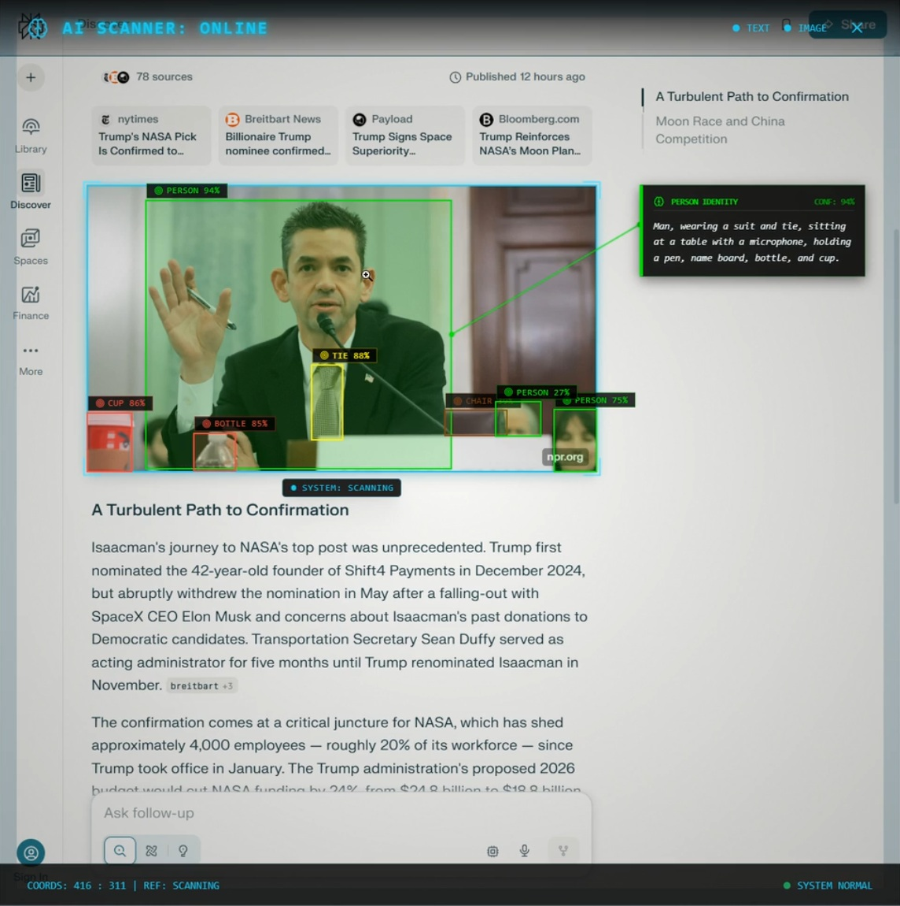
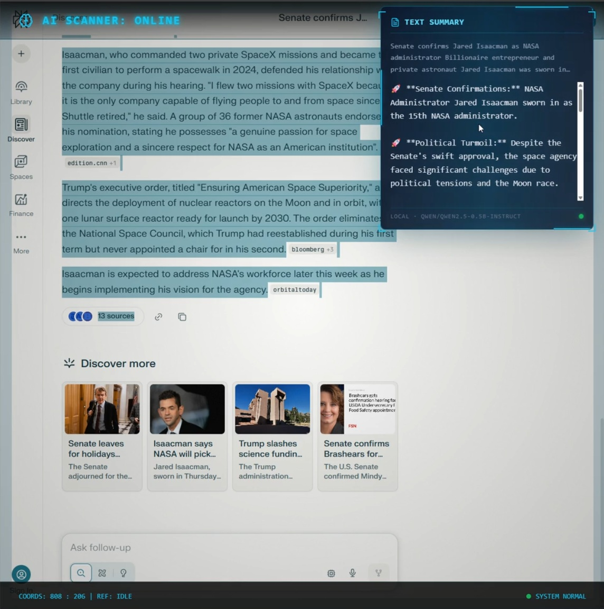

# AI Scanner Tool (Cyberpunk HUD) 🖼️⚡

A high-performance, aesthetically-driven browser extension and backend server for near real-time object detection, deep analysis, and intelligent text summarization. Inspired by the "Cyberpunk 2077" scanner, this tool transforms your browsing experience with a rich, interactive HUD that provides instant insights into images and text.

 *(Image scanner)*

 *(Text summarizer)*

## Key Features ✨

### 🖥️ Cyberpunk Scanner HUD (Extension)
- **Real-time Object Detection**: Instantly identifies objects in images you hover over using YOLO11x.
- **Deep Identification**: Leverages Florence-2 (VLM) for detailed, context-aware descriptions of people, vehicles, animals, and more.
- **Intelligent Refinement**: Uses a local Qwen2.5-0.5B-Instruct LLM to process raw vision data into concise, "identity-focused" HUD reports.
- **Cyberpunk Aesthetics**: Features a dynamic reticle, and a glassmorphism HUD that follows your cursor.
- **Text Summarization**: Highlight text on any page and hold your trigger to get a sentiment-aware summary with emoji indicators.
- **Configurable Activation**: Choose your trigger (Shift, Ctrl, Alt, or Mouse Buttons) and toggle behavior.

### 🔌 Powerful AI Backend (Server)
- **Multi-Model Pipeline**: Orchestrates YOLO11x (Detection), Florence-2-large (VLM), and Qwen2.5 (LLM) for a comprehensive analysis.
- **High Performance**: Confirmed working well with GPU CUDA acceleration on cards with 12GB VRAM. (e.g., RTX 4070 Super+). Testing shows peaks of around 5.5GB of GPU VRAM usage.
- **Centralized Object Config**: Fine-grained control over color-coding, analysis tasks (VQA vs. Captioning), and identification hints.
- **Image Persistence**: Optional saving of scanned images for later review (requires an `images/` directory in the root).
- **CORS-Ready**: Built with FastAPI to serve the extension and any future web dashboards seamlessly.

---

## Tech Stack 🛠️

### Frontend (Extension)
- **Framework**: [React](https://react.dev/) + [TypeScript](https://www.typescriptlang.org/)
- **Build Tool**: [Vite](https://vitejs.dev/) with [CRXJS](https://crxjs.dev/vite-plugin)
- **Styling**: [Tailwind CSS](https://tailwindcss.com/)
- **Animations**: CSS Keyframes & Framer Motion (planned)

### Backend (Server)
- **Language**: [Python 3.12](https://www.python.org/)
- **API Framework**: [FastAPI](https://fastapi.tiangolo.com/)
- **Vision Models**: 
  - [Ultralytics YOLO11x](https://github.com/ultralytics/ultralytics) (Detection)
  - [Florence-2-large](https://huggingface.co/microsoft/Florence-2-large) (VLM)
- **Language Model**: [Qwen2.5-0.5B-Instruct](https://huggingface.co/Qwen/Qwen2.5-0.5B-Instruct) (Summarization/Refinement)
- **Inference**: [PyTorch](https://pytorch.org/) with CUDA

---

## Getting Started 🚀

# **Note: This project requires approximately 8-10 GB of disk space for models, weights, node modules and python dependencies. So please make sure you have enough space.**

### 1. Prerequisites
- **NVIDIA GPU**: Highly recommended for real-time performance (e.g., RTX 30-series or 40-series) *might work on GPU cards with at least 6GB VRAM.*
- **Python 3.12** (only tested with 3.12)
- **Node.js 18+**


### 2. Setup the Server
```bash
# Clone the repository
git clone https://github.com/deepspacetrader/ai-scanner-chrome-extension.git
cd ai-scanner-chrome-extension

# Install dependencies
pip install -r requirements.txt

# Download YOLO11x model weights
# Place 'yolo11x.pt' in the root directory (ai-scanner-chrome-extension/)
# Direct Download: https://github.com/ultralytics/assets/releases/download/v8.3.0/yolo11x.pt
# (Note: Ultralytics will also auto-download this on first run if missing)

# Create images folder (Optional: Required if "Save Scanned Images" is enabled)
mkdir images

# Run the server
py -3.12 server.py
# Server will start on http://localhost:8001
```

### 3. Setup the Extension
```bash
cd extension-react

# Install dependencies
npm install

# Build for development (with Hot Module Replacement)
npm run build
```

### 4. Load the Extension in Chrome
1. Go to `chrome://extensions/`
2. Enable **Developer mode** (top right).
3. Click **Load unpacked**.
4. Select the `extension-react/dist` folder (created after running `npm run dev` or `npm run build`).

---

## Usage Guide 📖

1. **Activate**: Launch the extension popup to configure your **Activation Key** (default: `Alt`) and **Activation Mode** (default: `Toggle`).
2. **Scan**: Visit any website, tap your activation key to toggle the HUD, and hover over an image.
3. **Analyze**: The HUD will appear, showing YOLO detections. High-confidence analyzable objects (People, Cars, etc.) will trigger a deep scan using Florence-2 and Qwen2.5.
4. **Summarize**: Highlight a block of text, ensure the HUD is active, and see the AI Scanner OS generate a concise summary.

---

## Configuration ⚙️

### `object_config.py`
The server uses a centralized configuration for object classes:
- **Color**: The hex color used for bounding boxes and HUD accents.
- **Is Analyzable**: Whether the object should trigger Deep Analysis.
- **Category**: Grouping for summary logic (Humans, Vehicles, Animals, etc.).
- **Task**: The Florence-2 task (`<DETAILED_CAPTION>` or `<VQA>`).
- **Prompt**: Targeted questions for the Vision model.

---

## License ⚖️

This project is licensed under the **MIT License**. It is free to use, share, copy, and distribute. See the [LICENSE](LICENSE) file for more details.
